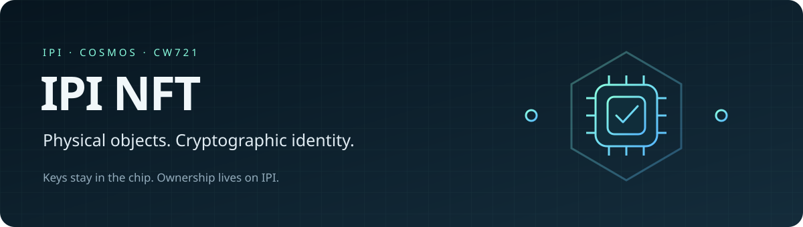
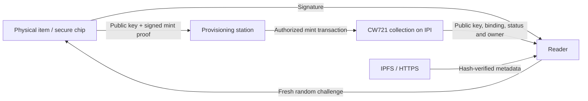

<p align="center">
  
</p>

<p align="center">
  <strong>A real NFT on IPI. A permanent identity inside the object.</strong><br />
  CW721 contract · Java Card proof protocol · TypeScript SDK · Command-line tools
</p>

<p align="center">
  <a href="docs/DEPLOYMENT.md">Deploy on IPI</a> ·
  <a href="docs/CHIP-PROTOCOL.md">Chip protocol</a> ·
  <a href="docs/REVIEW.md">Repository review</a> ·
  <a href="SECURITY.md">Security model</a>
</p>

---

## What is IPI NFT?

IPI NFT connects a physical item to a standard, transferable NFT on the IPI Cosmos blockchain. Each item contains an asymmetric secure chip. During provisioning, the chip generates its own secp256k1 key pair. The private key stays inside the chip; the public key becomes part of the NFT's permanent identity.

A reader authenticates an item by sending a fresh random challenge. The chip signs a message containing that challenge and its locked NFT binding. The reader checks the signature against the public key recorded on IPI. Copying the public key, NFC data or image is insufficient to answer a new challenge.

The contract implements CW721 ownership, transfers, approvals, receiver callbacks, enumeration and burning. No separate web application is required.

> **Release status:** v0.1.0 is a deployment candidate targeting `ipi-testnet-1`. This repository contains the contract, tested Wasm build, SDK and CLI. A live collection has **not** been recorded. Java Card applet provisioning and the **NFT Station** tab in `ipi-pokedex` are the next integration phase; they are not implemented here.

## The system at a glance



| Component | Responsibility |
| --- | --- |
| **Chip** | Generates and retains its private key; signs proofs for its permanently locked binding. |
| **Contract** | Records the NFT, chip public key, metadata commitment and owner; enforces CW721 permissions. |
| **SDK** | Constructs canonical messages, normalizes Java Card signatures, checks the deployment and authenticates fresh proofs. |
| **CLI** | Prepares metadata and unsigned transaction messages; verifies deployments, transaction results and metadata. |
| **IPI native node CLI** | Signs and broadcasts with IPI's own account/keyring implementation. |
| **Pokédex, next phase** | Installs the NFT applet, provisions chips and coordinates issuance. |

**Ownership and authenticity are separate.** The owner's IPI account controls transfers. The chip proves possession of the key assigned to the item. Passing an item to another person does not automatically transfer its on-chain NFT, and transferring the NFT does not prove physical delivery.

## Guarantees enforced by the contract

- Only the configured minter can issue new NFTs. Minter rotation uses a two-step ownership handover.
- Minting requires a valid chip signature bound to the **chain, collection, token ID, metadata URI, metadata hash, issuer and initial owner**.
- The chip key, metadata URI and metadata hash are immutable after minting.
- A token ID and a compressed chip public key can each be used once per collection. Burning preserves an issuance tombstone and never releases either identity.
- Standard CW721 transfers and approvals remain available. A chip signature does not grant permission to move an NFT or spend funds.
- The supported deployment has **no upgrade administrator**. The SDK verifies this together with the chain ID, collection address, code ID, Wasm checksum and protocol version.

Cryptography proves control of a key. Establishing that the key was generated inside approved, non-exportable hardware also requires trusted provisioning and a qualified applet. See the [security model](SECURITY.md).

## Quick start

Requirements: **Node.js 24**, npm, Docker with Linux container support. Docker uses the pinned CosmWasm optimizer image and Rust 1.86.0; a host Rust installation is optional. On ARM hosts, Docker must support `linux/amd64` emulation. First builds download the toolchain dependencies and take longer.

```sh
npm ci --ignore-scripts
npm test
npm run test:contract
npm run schema
npm run build:contract
```

The build produces:

```text
artifacts/
├── ipi_nft.wasm     # Optimized contract for MsgStoreCode
├── checksums.txt    # SHA-256 checksum
└── release.json     # Toolchain, source hashes, Git revision and artifact identity
```

`build:contract` also validates and runs the **actual optimized Wasm** in CosmWasm VM: instantiate → signed mint → proof verification → transfer → burn → rejected reissue. A failed build or VM test exits with an error. Only a fully successful run writes the release manifest.

`release.json` records whether the checkout was dirty. Build again after committing when producing a release tied to an exact Git revision. Build artifacts are intentionally excluded from source control; distribute them with their manifest through your release process.

## Prepare an item

Create deterministic metadata from a PNG, JPEG or WebP image, up to 1 MiB:

```sh
npm run nft -- metadata \
  --image ./my-item.png \
  --name "IPI Object #1" \
  --description "The first physical object in the collection." \
  --out ./data/item-1
```

This creates the image copy, `metadata.json` and a manifest with content hashes and IPFS URIs. It **does not publish** the files. The generated URIs use **CIDv1 raw blocks**, not UnixFS wrapping. Publish and pin the exact image and metadata bytes before minting; the [deployment guide](docs/DEPLOYMENT.md#3-publish-the-item-metadata) provides matching Kubo commands.

After a collection is deployed, the issuance flow is:

1. Freeze and publish the metadata; select the token ID and initial owner.
2. Create a mint request for that exact collection and item.
3. Provision the chip: generate its key internally, lock the binding, read the public key and obtain the mint proof.
4. Convert the card's DER signature into the canonical chain message.
5. Have the authorized issuer sign and broadcast through the native IPI CLI.
6. Confirm successful execution and read the issuance back from the chain.

Complete commands, recovery rules and deployment configuration are in [DEPLOYMENT.md](docs/DEPLOYMENT.md). The CLI never accepts a chip private key.

## Integrate a reader

```ts
import { IpiNftClient, compactSignature } from "./dist/sdk/index.js";

const client = new IpiNftClient(verifiedDeployment);
const token = await client.authenticateChip("item-1", async ({ nonce, bindingHash }) => {
  // Your qualified applet checks the binding and signs:
  // IPI_NFT_PROOF_V1\0 || storedBindingHash || nonce
  const der = await card.prove({ nonce, bindingHash });
  return compactSignature(der, "der");
});

console.log(token.owner); // Owner observed on IPI after authentication
```

`verifiedDeployment` is an operator-approved record containing `chainId`, `rest`, `collection`, `codeId` and `wasmSha256`. `card.prove` is the transport adapter supplied by the future hardware integration, not a function included in this SDK. The adapter must check the chip's locked binding against the supplied hash.

The reader generates a random 32-byte nonce, permits one verification attempt and expires the challenge after 30 seconds. It checks chain status again after the card responds. REST queries rely on the configured trusted node; this SDK is not a light client.

## Contract interface

| Category | Messages |
| --- | --- |
| Issuance | `mint`, `update_minter_ownership` |
| CW721 execution | `transfer_nft`, `send_nft`, `approve`, `revoke`, `approve_all`, `revoke_all`, `burn` |
| CW721 queries | `owner_of`, `nft_info`, `all_nft_info`, `num_tokens`, `tokens`, `all_tokens`, approvals and ownership queries |
| IPI queries | `protocol`, `issuance`, `token_by_chip`, `verify_chip` |

JSON schemas are checked into [`schema/`](schema/). Public keys and signatures use base64 in contract messages; SHA-256 digests and nonces use hexadecimal. Token IDs and code IDs remain strings in the SDK. `verify_chip` is a mathematical signature check; callers must supply and track a fresh nonce to establish live possession.

The contract exposes no metadata update, arbitrary extension execution, fund withdrawal or migration entry point. Do not attach funds to NFT executions. The IPI deployment must use `--no-admin` to prevent replacement with another contract.

## Repository map

```text
contracts/ipi-nft/  CosmWasm CW721 contract and integration tests
sdk/               TypeScript protocol, trusted-node client and CLI
tests/             SDK, reader and CLI tests
protocol/          Shared Rust/TypeScript proof vector (test key only)
schema/            Generated contract JSON schemas
deployments/       Explicit, initially unconfigured testnet template
tools/wasm-tests/  Tests that execute the optimized artifact in CosmWasm VM
scripts/           Pinned builds, Rust checks and release manifest
docs/              Deployment, hardware protocol, review and project artwork
```

## Development

```sh
npm run check           # Strict TypeScript check
npm test                # SDK and CLI tests
npm run test:contract   # Rust formatting, Clippy and contract tests in Docker
npm run format:rust     # Format Rust using the pinned toolchain
npm run schema          # Regenerate the contract ABI
npm run build:contract  # Optimize, validate, execute Wasm and write its manifest
npm run nft -- help
```

Test coverage includes permission failures, modified mint commitments, cross-chain and cross-collection replay, canonical signatures, burn tombstones, CW721 approvals and receiver behavior, challenge replay/expiry, deployment mismatch, metadata tampering and CLI file protection. Hardware qualification and a live IPI deployment remain separate integration checks.

## License and provenance

[MIT](LICENSE). The repository originally contained an upstream Stargaze demo; that application has been replaced with the IPI contract and tooling. Original attribution and historical release notes remain in [UPSTREAM.md](UPSTREAM.md) and [docs/history/](docs/history/). CW721 behavior builds on the [public-awesome/cw-nfts](https://github.com/public-awesome/cw-nfts) implementation.
