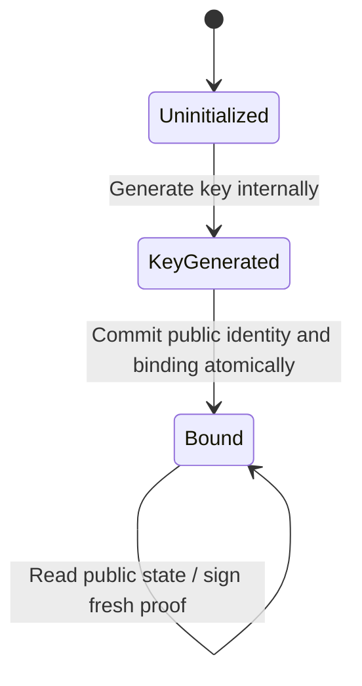

# IPI NFT chip protocol v1

Protocol identifier: **`ipi-nft-chip-v1`**. This specification defines the bytes shared by the contract, SDK and future NFT applet. It does not declare a particular card model qualified or provide an installed applet. The shared fixture in [`protocol/vectors.json`](../protocol/vectors.json) is tested in TypeScript, native Rust and the optimized Wasm VM.

## Identity and ownership

One collection permanently associates a token ID with a compressed secp256k1 public key, token URI and metadata SHA-256. The key and ID cannot be reused in that collection, even after burning. The immutable binding also includes chain ID and collection address, so a proof cannot move to a different deployment.

The initial owner is authenticated by the mint proof. Current ownership subsequently follows CW721 transfers. Owner changes do not rewrite the chip. There is no chip-authorized transfer mechanism in v1, and no global uniqueness registry across arbitrary collections.

## Encoding rules

- Hash function: SHA-256.
- Curve: **secp256k1**, not secp256r1/P-256. Keys must use the exact k1 domain parameters.
- Public key on-chain: compressed SEC1, 33 bytes, prefix `02` or `03`. A card's 65-byte uncompressed key is normalized by the SDK after curve validation.
- Card signature: ASN.1 DER ECDSA. SDK conversion produces compact 64-byte `r || s`, each integer unsigned big-endian and left-padded to 32 bytes.
- On-chain signatures require `1 <= s <= n/2` (low-S); SDK normalization replaces high `s` with `n - s`. Curve verification rejects invalid scalars/points.
- `LP(s)` means **two bytes of unsigned big-endian UTF-8 byte length**, followed by the exact UTF-8 bytes. There is no implicit NUL terminator, Unicode normalization or JSON encoding.
- Domain strings below end with one literal `00` byte. `||` means concatenation.
- Contract JSON: `Binary` keys/signatures are canonical base64; `HexBinary` digests/nonces are hexadecimal. CLI input uses hexadecimal for card responses.

Validated protocol limits: chain ID 1–128 UTF-8 bytes with no control characters; token ID 1–128 characters matching `[A-Za-z0-9._:-]`; token URI at most 512 ASCII bytes without whitespace/control characters, beginning with nonempty `ipfs://` or `https://`. URI validation is a bounded scheme check; the byte hash is authoritative. Collection and account addresses are canonical IPI Bech32 strings.

### Permanent binding

```text
bindingHash = SHA256(
    "IPI_NFT_BINDING_V1\0"
    || LP(chainId)
    || LP(collectionAddress)
    || LP(tokenId)
    || LP(tokenUri)
    || metadataSha256[32]
)
```

The chip permanently stores `bindingHash` before issuance. It should also retain enough public identity data to discover the token, at least protocol, chain ID, collection address and token ID. Those public fields must be checked against the binding read from the approved collection; they are not a trust root.

The full JSON metadata is stored off-chain. Hash its **exact bytes**, including the newline produced by the CLI. Reformatting JSON or changing a field changes its identity. The metadata's image URI, image SHA-256 and MIME field commit the artwork. Read-only metadata verification never downloads or executes arbitrary URLs.

### Mint nonce

```text
mintNonce = SHA256(
    "IPI_NFT_MINT_V1\0"
    || LP(issuerAddress)
    || LP(initialOwnerAddress)
)
```

This nonce is deterministic and is not a live reader challenge. It prevents a valid mint proof from being redirected to a different issuer or initial owner. The contract also checks that the transaction sender is the current authorized minter.

### Signed proof

```text
message = "IPI_NFT_PROOF_V1\0" || bindingHash[32] || nonce[32]
digest  = SHA256(message)
signature = ECDSA_secp256k1(privateKey, digest)
```

The domain is 17 bytes and the complete message is **81 bytes**. Use `proofMessage()` for the canonical bytes. For minting, `nonce = mintNonce`. For live authentication, the reader chooses a fresh cryptographically random 32-byte nonce.

Java Card [`Signature.ALG_ECDSA_SHA_256`](https://docs.oracle.com/en/java/javacard/3.1/jc_api_srvc/api_classic/javacard/security/Signature.html) takes the complete message and hashes it once. Passing the digest to this hashing API would produce a double hash and an invalid proof. A raw/prehashed signing API instead receives exactly the 32-byte digest. These paths must never be mixed.

## Required applet lifecycle

The future NFT applet must enforce these transitions, including across resets and interrupted APDUs:



There is no transition from `Bound` to another identity. There is no private-key export, arbitrary private-key import, reset-key or rebind command. Perform internal generation using the card's supported [`KeyPair.genKeyPair`](https://docs.oracle.com/en/java/javacard/3.2/jcapi/api_classic/javacard/security/KeyPair.html) implementation and configured secp256k1 domain parameters. The host does not generate a private key to upload.

A production `prove(nonce)` command must build the domain-separated message **inside the applet** from its stored binding and the supplied nonce. It must not expose unrestricted raw signing with the NFT key. The 81-byte message returned by `mint-request` is an interoperability/debugging artifact; the host must verify it corresponds to the applet's stored binding.

Public discovery should return a protocol version, canonical public key, locked binding hash and token locator. Actual AID, CLA/INS values, APDU chaining, response format, status words and CAP version will be fixed and tested during the Pokédex/applet implementation; this release reserves no invented APDU numbers.

## GlobalPlatform provisioning

GlobalPlatform manages applet installation and administration. It is not itself proof of NFT authenticity. J3R110/J3R150 labels alone do not establish support for the required curve/API behavior. Qualify the exact silicon, OS, Java Card/GP versions and memory profile. Check at least:

1. On-card key generation with configured secp256k1 parameters; no host-generated production key path.
2. SHA-256 ECDSA interoperability, DER variants and compressed/uncompressed point export.
3. Persistent, atomic binding; repeated initialization, power loss and reset behavior.
4. Disabled export/import/reset/rebind commands and fixed-purpose signing.
5. SCP03 installation using the intended security domain and unique management keys; removal of transport/default keys after provisioning.
6. Removal/reinstallation behavior: replacing an applet must never recreate its old private key or make a different key authenticate as the old NFT.
7. CAP identity/hash, reproducible build provenance and APDU fixtures for the reader adapter.

Use a separate NFT profile in Pokédex; a generic wallet applet with export/reset/arbitrary-signing behavior must not silently become the NFT applet. Log public issuance data and transaction hashes, never private keys or SCP03 secrets.

## Reader verification

1. Load an operator-approved deployment, not one trusted solely because the chip supplied it.
2. Verify chain ID, exact collection, code ID/hash, protocol and absence of an upgrade administrator.
3. Load the issuance and current owner. Reject unknown or burned identities. Recompute the binding.
4. Check the card's advertised public key and locked binding against that record.
5. Generate a new random 32-byte challenge **in the reader**. Keep it private to the current attempt until transmission; do not reuse or accept a card-selected nonce.
6. Ask the chip for a proof, normalize its DER signature and verify against the on-chain key and binding. Permit one attempt and apply a short timeout.
7. Recheck chain status after the exchange. Display the observed owner separately from physical authenticity.

The SDK implements steps 2, 3, 5, 6 and 7. The card transport implements steps 4 and the APDU exchange. `ChipChallenge` snapshots its inputs, returns defensive copies, defaults to a 30-second lifetime and consumes the challenge even on a failed verification attempt. The on-chain `verify_chip` query cannot enforce freshness; it returns a mathematical result for whatever nonce the caller supplied.

A live signature establishes that the key answered. It cannot prevent a relay to a remote genuine chip, prove legal title to the object, detect moving a genuine chip into a counterfeit enclosure or guarantee continued IPFS availability. Physical construction and deployment policy must address those concerns separately.
